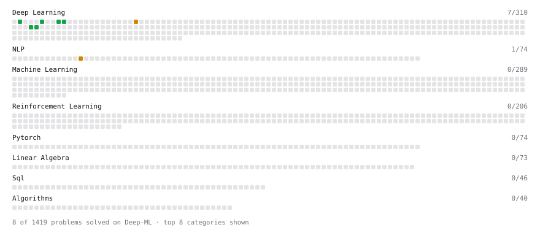

# Deep-ML

My machine learning practice from [Deep-ML](https://www.deep-ml.com). Every solution here was written by hand.

**7** solved · 7 problems · 0 labs · 0 math

[**Browse the interactive portfolio**](https://wjy0224-emma.github.io/deep-ml/) to replay this filling in over time.

## Problems

| | Difficulty | Solved | |
| --- | --- | --- | --- |
| [Character-Level Tokenizer (stoi/itos/BOS)](https://www.deep-ml.com/problems/374) | easy | 2026-09-19 | [solution](problems/0374-character-level-tokenizer-stoi-itos-bos) |
| [Implement ReLU Activation Function](https://www.deep-ml.com/problems/42) | easy | 2026-09-19 | [solution](problems/0042-implement-relu-activation-function) |
| [Implement the Square ReLU Activation Function](https://www.deep-ml.com/problems/373) | easy | 2026-09-19 | [solution](problems/0373-implement-the-square-relu-activation-function) |
| [Implementation of Log Softmax Function](https://www.deep-ml.com/problems/39) | easy | 2026-09-19 | [solution](problems/0039-implementation-of-log-softmax-function) |
| [Leaky ReLU Activation Function](https://www.deep-ml.com/problems/44) | easy | 2026-09-19 | [solution](problems/0044-leaky-relu-activation-function) |
| [Byte Pair Encoding (BPE) Tokenizer](https://www.deep-ml.com/problems/380) | medium | 2026-09-19 | [solution](problems/0380-byte-pair-encoding-bpe-tokenizer) |
| [Implement PReLU Forward and Backward Pass](https://www.deep-ml.com/problems/98) | medium | 2026-09-19 | [solution](problems/0098-implement-prelu-forward-and-backward-pass) |

---

_This file is regenerated by Deep-ML on every push._
